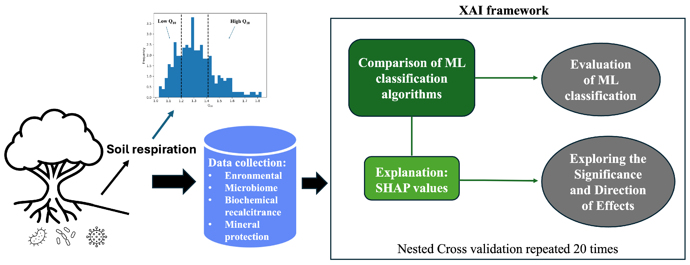
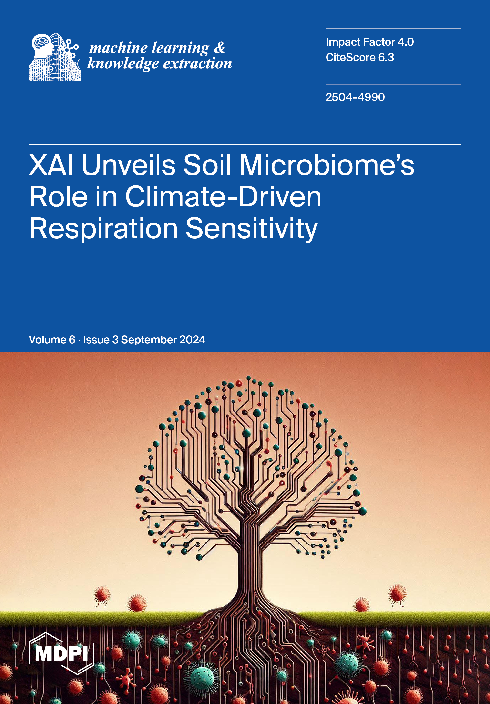

# Climate-Change-and-Soil-Health-XAI

## 📄 Paper Information

**Title:** Climate Change and Soil Health: Explainable Artificial Intelligence Reveals Microbiome Response to Warming  
**Authors:** Pierfrancesco Novielli, Michele Magarelli, Donato Romano, Lorenzo de Trizio, Pierpaolo Di Bitonto, Alfonso Monaco, Nicola Amoroso, Anna Maria Stellacci, Claudia Zoani, Roberto Bellotti and Sabina Tangaro  
**Journal:** *Machine Learning and Knowledge Extraction (MAKE)*, Volume 6, Issue 3 - 2024  
**DOI:** [https://doi.org/10.3390/make6030075](https://doi.org/10.3390/make6030075)
**Published:** 10 July 2024

---

## 🧠 Project Overview

This project investigates the impact of global warming on soil health by analyzing the soil microbiome's response to temperature increases. Using an **Explainable AI (XAI)** approach, the study identifies key microbial taxa and soil properties that contribute to soil respiration ($R_s$) and its temperature sensitivity ($Q_{10}$).

By moving beyond "black-box" models, this research provides ecological insights into how microbial communities adapt to climate change, highlighting the transition from K-strategists to r-strategists in warmed soil environments.

### Key Features:
- **Predictive Modeling:** Comparison of Random Forest (RF) and Extreme Gradient Boosting (XGBoost) for soil respiration flux.
- **XAI Integration:** Utilization of SHAP (SHapley Additive exPlanations) to rank the importance of microbial phyla and environmental variables.
- **Ecological Analysis:** Correlation between microbial life strategies and soil physical-chemical properties under warming conditions.

---

## ⚙️ Environment Setup

The analysis was conducted using Python 3.x. Key dependencies include:
* `scikit-learn`
* `xgboost`
* `shap`
* `pandas`
* `matplotlib`

---

### Methodology Summary
The workflow implemented in this repository follows these stages:

1.  **Data Integration:** Combining metagenomic data (microbial abundance) with soil physical and chemical parameters.
2.  **Model Training:** Training ensemble models (RF and XGBoost) to predict soil respiration rates.
3.  **Hyperparameter Tuning:** Optimization of model parameters to ensure robust predictive performance.
4.  **Explainability (SHAP):** Local and global explanations to identify which microbes (e.g., *Proteobacteria*, *Actinobacteriota*) are most influential under warming.
5.  **Statistical Validation:** Assessment of model accuracy using metrics such as $R^2$, MAE, and RMSE.
